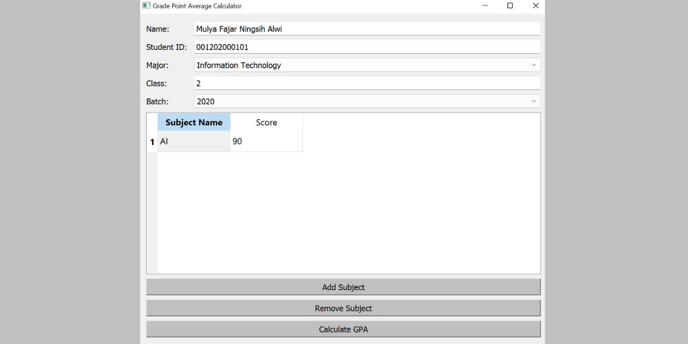

# President University GPA Calculation using Python Programming Language
This is the final project of the Object-Oriented and Visual Programming course. This project aims to help President University student to calculate their own GPA with an object-oriented and visual programming concept using the Python programming language with help of the PyQt5 library to create the GUI. 

The program accepts student bio data (name, student id, major, class, and batch), subject name, and subject score that are input by the user. In the program, I assume each subject has a credit of 3 also in the GUI there are 3 buttons such as, 'add subject' used to add the subject input field for the user, 'remove subject' used to remove the last line of the subject that inputted and 'calculate GPA' used to calculate/process the user input. 

The result will show the student's bio data (name, student id, major, class, and batch), the number of grades A-E that the student gained, total index score, total credits, and the total GPA.

